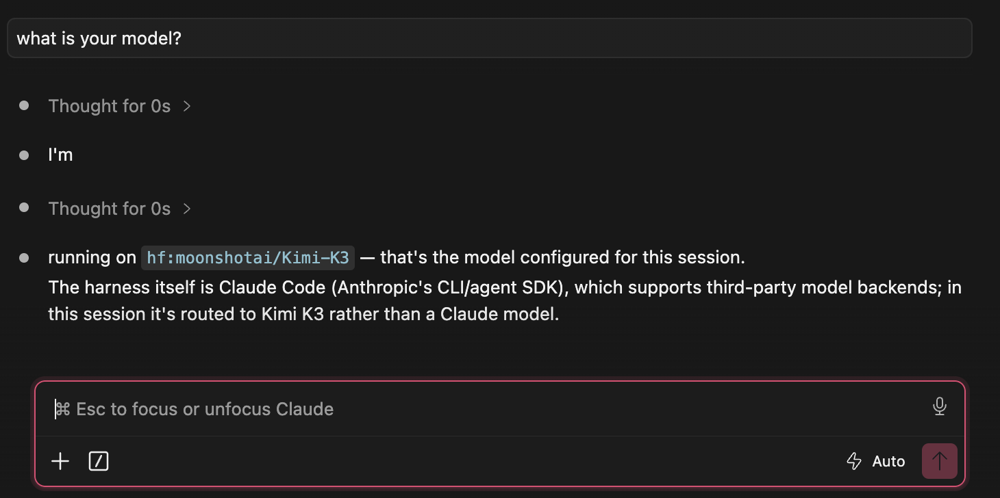
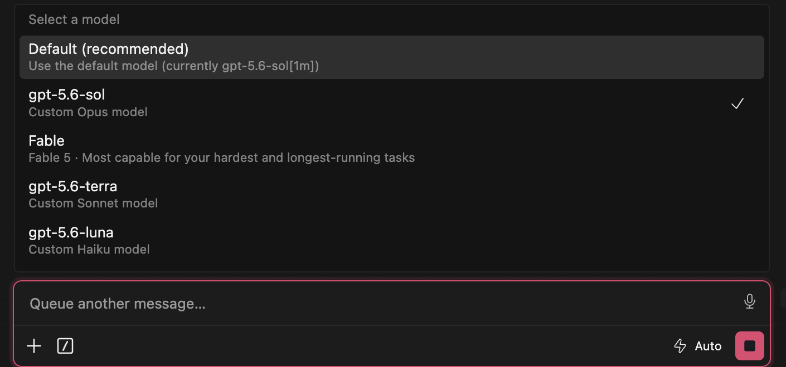
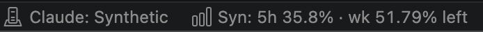

<p align="center">
  
</p>

<h1 align="center">ModelHop for Claude Code</h1>

Use Anthropic, Synthetic, OpenAI API, or your ChatGPT/Codex allowance from the Claude Code editor extension in Cursor and VS Code. ModelHop handles credentials, per-role model routing, usage, provider switching, and conversation compatibility.

> **Want Kimi K3 in Claude Code? [Create a Synthetic account](https://synthetic.new/?referral=mTRNs0GS)**
>
> This is the maintainer's referral link.

[Support ModelHop on Buy Me a Coffee](https://buymeacoffee.com/markrpg).

ModelHop targets Anthropic's graphical [Claude Code extension for VS Code and Cursor](https://marketplace.visualstudio.com/items?itemName=anthropic.claude-code). It does not configure standalone Claude Code CLI sessions.

## Providers and billing

| Provider | Account used | Usage charged to | Status |
|---|---|---|---|
| Anthropic | Claude.ai OAuth or your Anthropic API key | Anthropic/Claude | Stable |
| Synthetic | Synthetic API token | Synthetic quota | Stable |
| OpenAI API | OpenAI Platform API key | OpenAI API billing | Release candidate |
| OpenAI via ChatGPT/Codex | ChatGPT sign-in through a managed Codex runtime | ChatGPT/Codex allowance | **Experimental** |

The two OpenAI routes do not consume Claude model usage. Claude Code remains the editor UI and tool runner; ModelHop sends model requests through a loopback compatibility bridge.

## Kimi K3 in Claude Code

Synthetic exposes Kimi K3 as `hf:moonshotai/Kimi-K3`. ModelHop uses that canonical ID by default for the Default, Opus, Sonnet, and subagent roles. Model pickers lead with readable names and keep the exact API ID visible.



[See Synthetic's current model catalogue](https://dev.synthetic.new/docs/api/models), or [create a Synthetic account with the maintainer's referral link](https://synthetic.new/?referral=mTRNs0GS).

## Install

1. Install [Claude Code for VS Code](https://marketplace.visualstudio.com/items?itemName=anthropic.claude-code).
2. Download `modelhop-for-claude-code-2.1.0.vsix` from the [latest release](https://github.com/markrpg/synthetic-for-claude-code/releases/latest).
3. Run **Extensions: Install from VSIX...** in Cursor or VS Code.
4. Select the VSIX and reload the editor.

The internal extension ID remains `private.claude-provider-switcher`, so v2 upgrades the existing extension. Existing `claudeProvider.*` settings still work. New settings use `modelHop.*`.

## Switch providers

Click the `Claude: ...` status item or run **ModelHop: Switch Provider**.

- **Anthropic** restores Claude Code's native authentication.
- **Synthetic** asks for a token on first use.
- **OpenAI API** validates and stores an OpenAI Platform key on first use.
- **OpenAI via ChatGPT/Codex** shows a one-time warning, installs a verified pinned Codex runtime, and opens browser sign-in.

Provider changes use a full Cursor or VS Code window reload. This is the reliable way to refresh Claude Code's environment and reopen its current conversation. Running responses and subagents stop during reload.

The confirmation dialog includes **Don't ask again**. Re-enable it with `modelHop.confirmBeforeReload`.

## Model routing

Each non-Anthropic provider has separate mappings for Claude Code's Default, Opus, Sonnet, Haiku, and subagent roles.

OpenAI starts with:

| Claude role | Model | Reasoning |
|---|---|---|
| Default and Opus | `gpt-5.6-sol` | high |
| Sonnet and subagents | `gpt-5.6-terra` | medium |
| Haiku | `gpt-5.6-luna` | low |

The OpenAI API picker reads `/v1/models` and shows models in ModelHop's bundled Claude-tool compatibility catalogue. The Codex picker uses the signed-in account's `model/list` response, including its supported reasoning efforts. A missing configured model stops the switch and opens reconfiguration; ModelHop does not silently substitute another model.

Synthetic model routing uses the provider's live model list.



## Usage

The status bar changes with the active provider.

- Synthetic shows live five-hour and weekly quota, reset timing, and regeneration details. It refreshes every minute by default and when the editor regains focus.
- OpenAI API shows bridge-session input, cached input, output tokens, request count, estimated cost for catalogued models, and rate-limit headroom. The [OpenAI usage dashboard](https://platform.openai.com/usage) remains authoritative.
- ChatGPT/Codex shows subscription usage, reset time, and available reset credits. Consuming a reset credit always requires a separate confirmation.




Synthetic does not document a manual quota-reset API. ModelHop only offers a reset action when Codex reports an available earned reset credit.

## Conversation continuity

Provider responses can contain tool IDs, tool names, result links, and thinking blocks that another provider rejects. ModelHop repairs current-workspace Claude Code transcripts automatically before a provider transition:

- invalid tool names and IDs get deterministic compatible replacements;
- tool results and nested caller links are updated with the matching ID;
- incompatible thinking and redacted-thinking blocks are removed;
- malformed or incomplete tool flows stop the switch instead of guessing;
- the original transcript is backed up in private extension storage.

This keeps the same Claude Code conversation usable after a switch. The repair runs locally and does not send transcript files anywhere.

## Automatic context management

Synthetic and both OpenAI routes pass through ModelHop's local compatibility bridge. Before each model request, the bridge estimates the complete Claude request—including system instructions, tool schemas, images, and reserved output—and compacts only when the selected model is nearing its context limit.

- Synthetic uses its token-count endpoint and live model context metadata when available.
- Codex supplies its model context window through app-server token-usage events.
- OpenAI API and providers that omit context metadata use the configurable conservative fallback.
- Completed old messages are summarized while recent history remains verbatim. Tool calls, parallel calls, and all linked results are kept as atomic units.
- Summaries are hash-bound to the exact transcript prefix, encrypted on disk, and reused on later turns without altering the Claude Code transcript.
- A provider context rejection at a safe transcript boundary triggers one more aggressive compaction attempt. A live Codex tool round-trip is never rewritten. If the request still cannot fit safely, ModelHop returns a terminal context error instead of repeatedly retrying it.

Compaction happens automatically between Claude Code requests, including after switching providers; it does not force a new chat. The summary request uses the active provider's Haiku-role model and therefore counts against that provider's quota or billing. Synthetic and both OpenAI routes do not consume Anthropic usage.

The defaults begin compaction at 72% of the model context window and retain about 32,000 recent tokens. Advanced controls are available as `modelHop.contextManagement.enabled`, `thresholdPercent`, `fallbackContextTokens`, and `retainRecentTokens`.

## Local compatibility bridge

ModelHop bundles an Anthropic-compatible server on `127.0.0.1`. Synthetic and both OpenAI routes use it for `/v1/messages` and `/v1/messages/count_tokens`, text, images, streaming, parallel tool calls, cancellation, context management, and Claude-compatible errors.

For OpenAI API, the bridge translates requests to the Responses API with `store: false`. Tool schemas use `strict: false`. Incompatible tool names and IDs are mapped deterministically. Encrypted reasoning items are retained in an encrypted local continuity store; ModelHop never fabricates Anthropic thinking signatures.

For the Experimental Codex route, ModelHop downloads official Codex `0.146.0` into extension storage and verifies the package SHA-512 digest before extraction. It uses a dedicated Codex home, ephemeral app-server threads, and Claude Code's tools through experimental `dynamicTools`. Codex shell, editing, web search, MCP, apps, plugins, skills, memories, hooks, and subagents are excluded from bridged turns.

The bridge survives full-window reloads and coordinates through a fixed loopback port. Claude Code receives a bridge-only token. OpenAI keys remain in SecretStorage and never appear in `claudeCode.environmentVariables`. If the bridge or selected model is unavailable, the request fails; it does not fall back to Anthropic.

## Credentials

- Synthetic and OpenAI API credentials are stored in VS Code SecretStorage and can be rotated or removed from ModelHop.
- Anthropic OAuth credentials stay under Claude Code's control.
- A settings-based Anthropic API key is protected while another provider is active and restored on return.
- ChatGPT/Codex sign-in and sign-out are handled by the isolated managed runtime.
- Logs redact registered credentials and never include request content.
- Unrelated Claude Code environment variables are preserved. Failed configuration writes roll back from a local snapshot.

## Experimental Codex limits

The Codex route depends on OpenAI's experimental app-server `dynamicTools` interface. This v2 candidate includes mocked multi-tool, isolation, cancellation, and reload-continuity coverage. It has also passed live account testing for model discovery, usage reporting, normal prompting, and Claude MCP tool registration. Keep this route marked Experimental until the wider multi-tool and reload-recovery matrix passes.

## Remove

Switch to Anthropic or run **ModelHop: Restore Previous Configuration** before uninstalling. Removing the extension alone does not rewrite `claudeCode.environmentVariables`.

## Development

```sh
npm install
npm run check
npm run package
```

`npm run package` creates `modelhop-for-claude-code-2.1.0.vsix` locally. Publishing, tagging, and GitHub releases are separate actions.

## License

[MIT](LICENSE)
