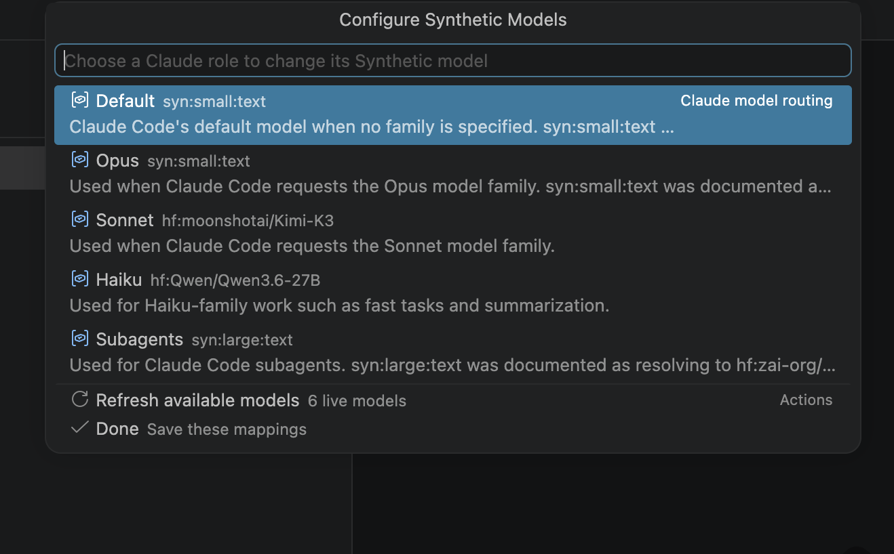
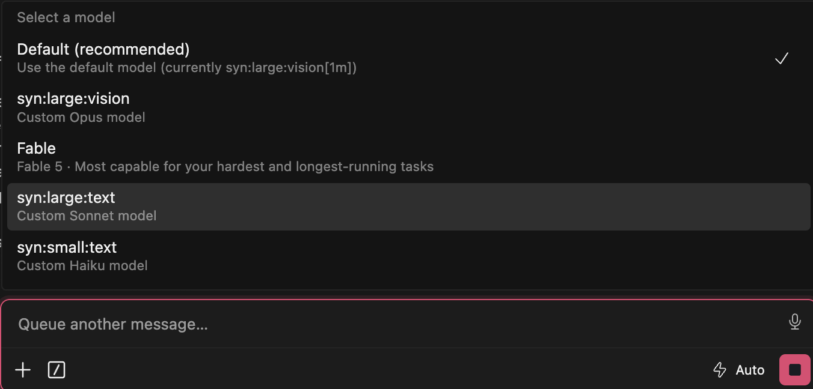

# Synthetic for Claude Code

Run Kimi K3 and other Synthetic models inside Anthropic's Claude Code editor extension for Cursor or VS Code. Switch providers, route each Claude role to a different model, and keep live five-hour and weekly quota visible.

> **New to Synthetic? [Create your Synthetic account →](https://synthetic.new/?referral=mTRNs0GS)**
>
> This is a referral link. You can also [download the latest VSIX](https://github.com/markrpg/synthetic-for-claude-code/releases/latest).

This project targets the graphical Claude Code editor extension. It does not install or configure standalone CLI sessions launched outside Cursor or VS Code.

## Run Kimi K3 in Claude Code

Synthetic currently lists Kimi K3 as an included beta model under `hf:moonshotai/Kimi-K3`, and its recommended `syn:large:vision` alias currently resolves to Kimi K3.

After switching the extension to Synthetic, choose **Configure Synthetic model routing** and assign either:

- `syn:large:vision` to follow Synthetic's current recommended large vision model.
- `hf:moonshotai/Kimi-K3` to pin a Claude role to Kimi K3 specifically.

You can route Default, Opus, Sonnet, and subagents to Kimi K3 while keeping Haiku on a smaller model for fast tasks and summarization. The picker reads Synthetic's live model list, shows alias resolutions, and warns before you pin a model that Synthetic may rotate out later.

See Synthetic's [current model catalogue](https://dev.synthetic.new/docs/api/models) for availability.

## Preview

The status bar shows the active provider and live Synthetic quota:

Configure a separate Synthetic model for each Claude role:

Choose from recommended aliases and currently available models:

## Requirements

- Install Anthropic's [Claude Code for VS Code](https://marketplace.visualstudio.com/items?itemName=anthropic.claude-code).
- Cursor users can follow Anthropic's [VS Code and Cursor installation guide](https://code.claude.com/docs/en/ide-integrations).
- Create an API key from your [Synthetic account](https://synthetic.new/?referral=mTRNs0GS) (referral link).

## Install

1. Download `synthetic-for-claude-code-1.2.1.vsix` from the [latest GitHub release](https://github.com/markrpg/synthetic-for-claude-code/releases/latest).
2. In Cursor, run **Extensions: Install from VSIX…** from the Command Palette.
3. Select the downloaded VSIX.
4. Reload Cursor when prompted.

The internal extension ID remains `private.claude-provider-switcher`, so this build upgrades versions 1.1.x and 1.2.0 without creating a second extension. Existing `claudeProvider.*` settings are preserved.

## Use

Click the `Claude: …` status item or run **Synthetic for Claude Code: Select Provider**.

- Choose **Synthetic** to enter or reuse an API token and apply the configured model routes.
- Choose **Anthropic** to remove Synthetic-specific overrides and restore Claude Code's native authentication.
- Choose **Configure Synthetic model routing** to assign models to Claude roles.
- Choose **View Synthetic quota and usage** for current limits and regeneration details.

Provider changes require a Cursor reload. Active Claude requests and subagents stop during that reload.

If the status item is hidden, run **Synthetic for Claude Code: Use Anthropic** or **Synthetic for Claude Code: Use Synthetic** from the Command Palette.

## Model routing

The model picker reads `GET https://api.synthetic.new/openai/v1/models` and filters out embedding models. Recommended aliases appear before the live model list.

| Claude role | Initial model |
|---|---|
| Default, Opus, Sonnet, subagents | `syn:large:vision` |
| Haiku | `syn:small:text` |

Synthetic may change alias targets. The picker shows each current alias resolution and warns before a model is pinned to a specific `hf:` ID.

References: Synthetic's [Claude Code guide](https://dev.synthetic.new/docs/guides/claude-code), [available models](https://dev.synthetic.new/docs/api/models), and [`/models` API](https://dev.synthetic.new/docs/openai/models).

## Quota

While Synthetic is active, the status bar shows percentages remaining for the rolling five-hour request window and weekly credits, for example `Syn: 5h 33.2% · wk 56.73% left`.

Quota data comes from `GET https://api.synthetic.new/v2/quotas`. The extension uses `rollingFiveHourLimit` and `weeklyTokenLimit` when returned. The older `subscription` counter appears only as a labelled `legacy` fallback.

See Synthetic's [`/quotas` reference](https://dev.synthetic.new/docs/synthetic/quotas) or run **Synthetic for Claude Code: Open Usage and Billing**.

## Credentials and settings

- The source Synthetic token is stored in VS Code `SecretStorage`.
- Claude Code requires the active token in `claudeCode.environmentVariables`, where it may be visible in Cursor's user settings while Synthetic is active. Switching to Anthropic removes it.
- Logs and configuration summaries redact credential values. API response bodies are not logged.
- Model and quota requests send the token only to the fixed Synthetic HTTPS endpoints documented above.
- Provider writes are global. Workspace or folder overrides can still take precedence; the extension warns before continuing.
- Unrelated Claude Code environment variables are preserved. Failed changes are rolled back from an extension snapshot.

Model routes and the quota refresh interval are available under **Synthetic for Claude Code** in Cursor settings. Set `claudeProvider.synthetic.usageRefreshMinutes` to `0` to disable automatic quota refresh.

## Remove

Switch to Anthropic or run **Synthetic for Claude Code: Restore Previous Configuration** before uninstalling. Removing the extension alone does not rewrite `claudeCode.environmentVariables`.

## License

Released under the [MIT License](LICENSE).
