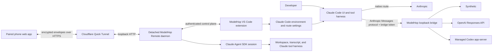

# ModelHop for Claude Code — Product Technical Specification

| Field | Value |
| --- | --- |
| Document status | Working implementation specification |
| Specification revision | 1.0 |
| Implementation baseline | ModelHop package `2.2.4` |
| Remote implementation build | `2.2.4-remote.6` |
| Bridge protocol | `2.1.0+context-ledger` |
| Remote protocol | `1.3.0` |
| Baseline date | 6 August 2026 |
| Host | Claude Code extension for Cursor and VS Code |
| License | MIT; bundled dependencies retain their own terms |

This baseline describes the current local working tree and verified local
VSIX. It does not by itself mean the changes have been committed, published,
tagged, or released. The Git remote currently trails this implementation, and
remote publication remains separately authorized work.

## 1. Purpose and status language

This document is the normative product and engineering specification for
ModelHop for Claude Code. It describes the product currently represented by
the repository, the contracts its components must preserve, and the release
criteria for changing those contracts.

It is intended for maintainers, contributors, security reviewers, release
engineers, and developers integrating a new model provider or Remote feature.
The README remains the concise user guide; this document is the system design,
behavioral contract, and acceptance reference.

The words **MUST**, **MUST NOT**, **SHOULD**, **SHOULD NOT**, and **MAY** are
normative. Feature maturity is labelled as follows:

- **Stable** — intended for normal use and covered by the standard release
  gate.
- **Release candidate** — implemented and packaged, but not yet promoted to
  Stable across the complete live compatibility matrix.
- **Experimental** — usable, explicitly disclosed, and fail-closed, but
  dependent on an experimental upstream interface or transport.
- **Development preview** — present in the working implementation but not a
  general compatibility promise.
- **Future** — a product direction or requirement that is not claimed as
  shipped behavior.

Where prose, fixtures, and production code disagree, production code and its
passing tests define the current implementation. The disagreement must then be
resolved in this document before release.

## 2. Product definition

ModelHop is a local-first provider, compatibility, continuity, and remote
control layer for the graphical Claude Code extension in Cursor and VS Code.
It lets a developer keep Claude Code's interface and tool harness while
choosing which supported provider performs inference.

The supported routes are:

1. Anthropic using Claude Code's native authentication and model route.
2. Synthetic using a Synthetic API token and Anthropic-compatible upstream.
3. OpenAI API using an OpenAI Platform API key and the Responses API.
4. OpenAI via ChatGPT/Codex using an isolated managed Codex runtime and the
   signed-in account's allowance.

ModelHop also provides Experimental phone continuation. A detached controller
on the developer's Mac continues one Claude Code conversation while a paired
phone supplies prompts, approvals, provider controls, file context, and
operational visibility through an encrypted application protocol.

ModelHop is not:

- a replacement editor or a standalone Claude Code CLI configurator;
- a hosted model gateway, ModelHop account, or ModelHop-operated relay;
- a general remote desktop, unrestricted remote shell, or mobile source-code
  editor;
- an entitlement broker or source of authoritative provider billing data;
- a mechanism for silently falling back to Anthropic when another route
  fails.

## 3. Problems and developer outcomes

| Developer problem | Required ModelHop outcome |
| --- | --- |
| The Claude Code workflow is coupled to one provider and billing route. | Select among four explicit routes without changing the editor workflow. |
| Provider configuration requires fragile environment edits. | Own, validate, snapshot, apply, verify, and roll back only ModelHop-managed values. |
| Different tasks need different quality, latency, and cost profiles. | Route Default, Opus, Sonnet, Haiku, and subagent roles independently. |
| Tool-heavy conversations fail after a provider transition. | Repair compatible identifier, name, link, caller, and thinking differences locally and refuse unsafe guesses. |
| Long conversations exceed a model's context window. | Count the complete request and compact old, completed history without breaking tool relationships or forcing a fresh chat. |
| Quota, rate limits, and costs are hard to see. | Display route-specific usage with clear authority and freshness. |
| Work stops when the developer leaves the laptop. | Continue, inspect, steer, and approve one Mac-hosted conversation from a phone. |
| Remote and provider failures can create ambiguous state. | Preserve work, expose the true blocking state, and make recovery idempotent. |

The primary success outcome is continuity: a developer can choose an inference
route, keep the same Claude Code conversation, understand what is running, and
recover safely when a provider, editor window, phone link, or local process
fails.

## 4. Product principles and hard invariants

### 4.1 Route and billing invariants

- Every model request MUST have one explicit active provider.
- Synthetic and both OpenAI routes MUST use their own quota, billing, or
  allowance and MUST NOT consume Anthropic model usage.
- An unavailable bridge, token, account, model, or alternate provider MUST
  fail closed. ModelHop MUST NOT silently route the request to Anthropic.
- Provider labels, canonical models, reasoning settings, and usage MUST be
  correlated to the same route revision. A racing refresh MUST NOT relabel a
  query owned by another provider.
- A known cross-provider runtime model mismatch MUST prevent route commit and
  trigger rollback or explicit failure.

### 4.2 Conversation invariants

- A provider switch MUST preserve the current conversation whenever the
  transcript can be repaired without guessing.
- Tool calls and their results are atomic relationships. Compaction, repair,
  replay, or rendering MUST NOT orphan, duplicate, or cross-link them.
- ModelHop MUST create a private recovery copy before mutating a transcript.
- ModelHop MUST NOT open a blank or merely "last used" conversation as a
  substitute for the exact requested session.

### 4.3 Remote execution invariants

- Work is complete only when terminal evidence is durable. Absence from a
  live task list is a settling signal, not completion.
- A provider failure and a background workflow's completion are independent
  facts. The root request may fail while child work continues.
- Losing the phone display, browser tab, Quick Tunnel, or editor extension
  host MUST NOT cancel Mac-side work.
- Cancellation MUST be an explicit user action. Idle and attention thresholds
  MUST NOT become hidden cancellation deadlines.
- Only one phone and one editor owner may mutate a Remote session. Stale
  owners MUST be fenced from committing actions.
- A mutating phone command MUST be durably admitted before side effects and
  MUST execute at most once for a given command ID and request hash.
- Phone ownership MUST remain available until the exact Claude session is
  visibly confirmed on the laptop.
- Tunnel cleanup is a janitor concern after ownership transfer. Cleanup
  failure MUST NOT reopen the session, keep the status stuck in hand-back, or
  block the next lease.

### 4.4 Security invariants

- The inference bridge and Remote server MUST bind only to loopback.
- Provider credentials, repository credentials, bridge control tokens, and
  private logs MUST NOT be sent to the phone or embedded in the phone URL.
- Unknown or ambiguous remote tools MUST require approval.
- Paths MUST be canonicalized against registered workspace roots; traversal,
  escaped symlinks, credential paths, and unsafe retention targets MUST fail
  closed.
- Public tunnel failure MUST NOT cause LAN exposure or provider fallback.

## 5. Scope and maturity

| Area | Maturity | Current boundary |
| --- | --- | --- |
| Anthropic route | Stable | Native Claude Code authentication and provider behavior. |
| Synthetic route | Stable | Bridge-routed Anthropic-compatible inference, live models, and quota. Provider-private reasoning is not represented as Anthropic thinking. |
| OpenAI API route | Release candidate | Responses API compatibility and local usage estimation; OpenAI's dashboard remains billing authority. |
| OpenAI via ChatGPT/Codex | Experimental | Depends on Codex app-server and experimental `dynamicTools`. |
| Automatic context management | Stable for bridged routes | Summary requests consume the active alternate provider's quota or billing. |
| Transcript compatibility repair | Stable | Fails rather than guessing when the tool graph is malformed or incomplete. |
| ModelHop Remote | Experimental | Mac must stay powered, online, and awake; Cloudflare Quick Tunnels have no SLA. |
| Thinking, Workflows, and Ultra on Remote | Development preview | Availability is model- and runtime-reported. Codex-native child-agent orchestration remains disabled. |

## 6. System context

There are two related but separate local services:

1. The **compatibility bridge** adapts Claude's Anthropic Messages protocol to
   Synthetic, OpenAI Responses, or Codex app-server inference.
2. The **Remote daemon** owns a detached Claude SDK continuation, encrypted
   event journal, phone protocol, and hand-back transaction.

The extension host coordinates configuration, UI commands, credentials,
process ownership, exact-session opening, and full-window reloads. It is not
the lifetime owner of an active Remote turn.

## 7. Component architecture

| Component | Responsibility | Primary implementation |
| --- | --- | --- |
| Extension composition root | Activates services, commands, status items, bridge, and Remote manager. | `src/extension.ts` |
| Provider registry | Builds provider profiles, environment variables, model roles, and reasoning defaults. | `src/providers/` |
| Credential service | Stores independent provider and internal control secrets in SecretStorage. | `src/credentials/credentialService.ts` |
| Configuration transaction | Reads effective/global settings, preserves unrelated variables, validates, snapshots, writes, verifies, and rolls back. | `src/configuration/`, `src/core/switchTransaction.ts` |
| Compatibility bridge manager | Starts, authenticates, configures, reuses, and retires the detached loopback bridge. | `src/bridge/bridgeManager.ts` |
| Compatibility bridge daemon | Implements Anthropic routes and provider control routes. | `src/bridge/server.ts` |
| OpenAI translator | Maps messages, system text, images, tools, results, streams, IDs, and errors. | `src/bridge/anthropicOpenAITranslator.ts`, `openAIResponsesClient.ts` |
| Codex adapter | Runs app-server sessions, account/model/usage calls, dynamic tools, and cancellation. | `src/bridge/codexAppServerClient.ts` |
| Context manager | Counts complete requests, preserves tool units, summarizes historical prefixes, and stores encrypted summaries. | `src/bridge/contextManager.ts` |
| Transcript repair | Normalizes provider-incompatible transcript structures with backups and concurrency checks. | `src/transcripts/claudeTranscriptRepairService.ts` |
| Remote manager | Coordinates the extension-side daemon, tunnel, pairing confirmation, host actions, route transactions, recovery, and exact-session opening. | `src/remote/remoteManager.ts` |
| Remote daemon/server | Serves local/public routes, pairing, encrypted events, durable commands, and controller state. | `src/remote/server.ts` |
| Remote session controller | Owns the Claude SDK query, typed conversation/activity events, work ledger, capabilities, and authoritative completion. | `src/remote/sessionController.ts` |
| Remote journal and runtime store | Persist encrypted events, snapshots, command receipts, lease state, and recovery material. | `src/remote/eventJournal.ts`, `runtimeStore.ts`, `commandLedger.ts` |
| Quick Tunnel manager | Starts a pinned or user-supplied `cloudflared`, verifies registration and identity, and tracks process ownership. | `src/remote/quickTunnelManager.ts`, `cloudflaredRuntimeManager.ts` |
| Mobile application | Presents Chat, Files, Activity, Settings, approvals, provider controls, and responsive layouts. | `src/remote/web/` |

## 8. Extension identity and host compatibility

- Public name: **ModelHop for Claude Code**.
- Preserved internal extension name: `claude-provider-switcher`.
- Preserved extension ID: `private.claude-provider-switcher`.
- Minimum editor API: VS Code `^1.96.0`; Cursor is supported through its VS
  Code extension compatibility.
- Extension kind: UI.
- Activation: `onStartupFinished`.
- Host dependency: Anthropic's graphical Claude Code extension and its
  `claude-vscode.editor.open` exact-session command for Remote hand-back.
- Legacy `claudeProvider.*` settings and command aliases remain readable for
  upgrades. New configuration is written under `modelHop.*`.

ModelHop targets editor sessions. Installing it does not configure unrelated
standalone Claude Code CLI processes.

## 9. Provider architecture

### 9.1 Provider matrix

| Provider ID | Presentation | Authentication | Inference path | Usage charged to | Maturity |
| --- | --- | --- | --- | --- | --- |
| `anthropic` | Anthropic | Claude OAuth controlled by Claude Code, or remembered Anthropic API key | Claude Code directly to Anthropic | Anthropic/Claude | Stable |
| `synthetic` | Synthetic | Synthetic token in SecretStorage | Claude Code → loopback bridge → Synthetic Anthropic-compatible API | Synthetic quota | Stable |
| `openai-api` | OpenAI API | OpenAI Platform key in SecretStorage | Claude Code → loopback bridge → Responses API | OpenAI API billing | Release candidate |
| `openai-codex` | OpenAI via ChatGPT/Codex | Browser/device login in isolated managed Codex home | Claude Code → loopback bridge → Codex app-server | ChatGPT/Codex allowance | Experimental |

ModelHop can detect and structurally report a custom Anthropic gateway in the
effective environment, but custom gateways are not a fifth managed provider.
They receive validation/status treatment only and are never silently adopted
into ModelHop's credential, routing, or billing guarantees.

Anthropic model selection and per-role routing remain native Claude Code
concerns. ModelHop does not currently provide an Anthropic-specific model
mapping surface or authoritative Anthropic account-usage API.

### 9.2 Environment ownership

ModelHop owns only these provider keys in
`claudeCode.environmentVariables`:

- `ANTHROPIC_BASE_URL`
- `ANTHROPIC_AUTH_TOKEN`
- `ANTHROPIC_API_KEY`
- `ANTHROPIC_MODEL`
- `ANTHROPIC_DEFAULT_OPUS_MODEL`
- `ANTHROPIC_DEFAULT_SONNET_MODEL`
- `ANTHROPIC_DEFAULT_HAIKU_MODEL`
- `CLAUDE_CODE_SUBAGENT_MODEL`
- `MODELHOP_PROVIDER`

It may manage these shared preferences while preserving existing values when
configured to do so:

- `CLAUDE_CODE_DISABLE_NONESSENTIAL_TRAFFIC`
- `CLAUDE_CODE_ATTRIBUTION_HEADER`

Unrelated environment entries MUST survive a switch. ModelHop detects and
blocks conflicting Bedrock, Vertex, and Foundry route flags. Malformed global
settings MUST be repaired by the user before ModelHop writes, so valid entries
cannot be silently lost. Workspace or folder overrides are disclosed because
they may supersede the global provider selection.

Current ownership is key-based: ModelHop replaces or removes values under the
managed names regardless of who originally wrote them. It does not yet attach
per-value provenance. This is why it snapshots the previous global
configuration and preserves every unrelated key.

Alternate providers receive a bridge-only `ANTHROPIC_AUTH_TOKEN`. Upstream
Synthetic and OpenAI credentials MUST NOT appear in Claude's environment.

### 9.3 Credential lifecycle

- Synthetic and OpenAI API credentials are independently set, validated,
  rotated, and removed within the extension.
- Anthropic OAuth remains exclusively under Claude Code's control.
- If an Anthropic API key is present when leaving Anthropic, ModelHop protects
  it in SecretStorage and restores it when appropriate.
- Clearing the credential for an active alternate route requires confirmation
  and switches back to Anthropic rather than leaving Claude Code configured
  with a dead credential.
- ChatGPT/Codex account login and logout are scoped to the isolated managed
  runtime. The official runtime stores its own file-backed authentication in a
  private dedicated Codex home; that account session is not a VS Code
  SecretStorage value.
- Internal bridge, Remote control, device-store, host-identity, and launch
  secrets are independent values in SecretStorage.
- Every retrieved secret is registered with the redacting logger.

### 9.4 Role-based model routing

Each non-Anthropic route stores five independent roles:

| Role | Claude environment selector | Intended work |
| --- | --- | --- |
| Default | `ANTHROPIC_MODEL` | Requests without an explicit Claude family. |
| Opus | `ANTHROPIC_DEFAULT_OPUS_MODEL` | Opus-family work. |
| Sonnet | `ANTHROPIC_DEFAULT_SONNET_MODEL` | Sonnet-family work. |
| Haiku | `ANTHROPIC_DEFAULT_HAIKU_MODEL` | Fast work and context summaries. |
| Subagents | `CLAUDE_CODE_SUBAGENT_MODEL` | Claude Code subagent work. |

Current defaults are:

| Route | Default | Opus | Sonnet | Haiku | Subagents |
| --- | --- | --- | --- | --- | --- |
| Synthetic | `hf:moonshotai/Kimi-K3` | `hf:moonshotai/Kimi-K3` | `hf:moonshotai/Kimi-K3` | `hf:zai-org/GLM-4.7-Flash` | `hf:moonshotai/Kimi-K3` |
| OpenAI API | `gpt-5.6-sol` / high | `gpt-5.6-sol` / high | `gpt-5.6-terra` / medium | `gpt-5.6-luna` / low | `gpt-5.6-terra` / medium |
| OpenAI via Codex | Same initial mapping as OpenAI API; live account catalog is authoritative. |

The UI MUST display canonical provider model identity and reasoning effort,
not only Claude role aliases. If a configured model disappears, ModelHop MUST
offer reconfiguration and MUST NOT silently choose another model.

### 9.5 Model and capability discovery

- Anthropic Remote sessions use the model information reported by the Claude
  SDK initialization response.
- Synthetic combines its documented aliases with the live model endpoint,
  filters embedding-only rows, and retains reported context length where
  available.
- OpenAI API reads `/v1/models` and filters the response through the bundled
  Claude-tool compatibility catalog. The current catalog requires text,
  image, function-calling, and streaming support.
- OpenAI via Codex uses app-server `model/list` as the authority for model IDs,
  context windows, and supported reasoning efforts.
- A selector, canonical resolved model, or display label may be accepted only
  when it resolves uniquely to one provider selector.
- Runtime display copy such as `Default Claude model` MUST NOT become a wire
  model ID.

The advanced OpenAI API picker currently permits a manually entered model ID.
That path validates that the account can see the ID but bypasses ModelHop's
three-model compatibility catalog. It is an expert override, not a claim that
all Claude tool behaviors have been qualified for that model.

### 9.6 Reasoning, Thinking, Workflows, and Ultra

The common effort vocabulary is `none`, `low`, `medium`, `high`, `xhigh`, and
`max`. `none` means ModelHop omits provider effort; it is not necessarily a
provider-advertised effort value.

- ModelHop MUST expose only effort levels reported by the authoritative model
  catalog for the active route.
- For Anthropic, `xhigh` or `max` MUST NOT be sent while Claude adaptive
  Thinking is disabled. The UI and controller normalize or reject that pair
  before the API request.
- For Synthetic and OpenAI, Claude-harness Thinking and upstream private
  reasoning are separate concepts. Disabling the former does not promise to
  disable the latter.
- ModelHop MUST NOT fabricate Anthropic thinking signatures from upstream
  provider reasoning.
- Claude Workflows are an Experimental Claude-harness capability. The first
  orchestration request may receive session-scoped approval; descendant tools
  are still mediated independently.
- Ultra is available only when the runtime reports the necessary effort,
  Thinking is enabled where required, and Workflows are enabled.
- Codex-native child-agent orchestration remains disabled until descendant
  threads, approvals, recovery, cancellation, usage, and replay protection
  can be mediated end to end.

## 10. Provider switching transaction

### 10.1 Desktop transaction

A normal desktop provider switch follows this transaction:

1. Read effective and global Claude environment configuration.
2. Reject malformed containers or entries.
3. Disclose workspace/folder overrides and route conflicts.
4. Validate required credentials and configured models.
5. Remember a settings-based Anthropic key when leaving Anthropic.
6. Build the target environment and preserve unrelated/shared values.
7. Prepare and health-check the bridge for any bridged route.
8. Repair current-workspace transcripts when the provider changes and repair
   is enabled.
9. Capture a last-known-good snapshot.
10. Write the global environment atomically and read it back.
11. Validate the written route and record the active provider.
12. Mark a pending reload and request a full editor-window reload.
13. On any failure, restore the snapshot, clear the uncommitted route, and
    report the failure.

Transcript repair and bridge preparation currently occur before the settings
write transaction. A later environment rollback does not reverse an already
safe transcript repair and may leave the bridge configured for the attempted
route until the next prepare call. These local side effects are recoverable
but are not presently one atomic rollback unit.

A full window reload is intentional because it is the reliable way to refresh
Claude Code's process environment. The confirmation can be disabled with
`modelHop.confirmBeforeReload`; disabling confirmation does not disable
validation, repair, or rollback.

### 10.2 Remote transaction

Remote provider switching is a durable operation rather than a synchronous UI
command:

1. Record the operation and previous route before mutation.
2. Block new prompts and expose `switching-provider`.
3. Wait at the authoritative quiescence barrier.
4. Persist a provider/model/reasoning/environment/transcript checkpoint.
5. Apply settings without terminating the detached controller.
6. Perform the established full-window reload if the environment changed.
7. Reclaim the same operation after reload using its deterministic ID and
   fencing generation.
8. Start or reconfigure the query and wait for authoritative SDK
   initialization.
9. Verify that the initialized provider and known model family match the
   target route.
10. Commit the new route revision or restore the complete previous route.

A terminal provider error such as allowance exhaustion MUST settle the failed
foreground request even when the SDK omits its normal result frame. Late or
duplicate result frames may update metering but MUST NOT recreate a busy
latch. A hand-back may replace a queued provider switch only while that switch
is still `waiting-for-turn` and its host action has never been claimed. Once
settings mutation begins, the switch must commit or roll back before
ownership changes.

## 11. Local compatibility bridge

### 11.1 Network and process model

- The bridge is a detached local process that binds to `127.0.0.1` on a
  deterministic installation-scoped port.
- It survives normal full-window reloads and exits after a prolonged idle
  period (currently 24 hours without bridge activity).
- `/health` reports bridge protocol, selected provider, and readiness.
- `/control/*` requires an independent `x-modelhop-control` token.
- Claude-facing inference routes require the bridge bearer token.
- JSON request bodies are bounded; the current inference limit is 32 MiB.
- Stale or incompatible bridge builds are restarted rather than reused.

### 11.2 Claude-facing API

The bridge implements:

- `POST /v1/messages`
- `POST /v1/messages/count_tokens`

It supports non-streaming and streaming text, system instructions, images,
tool definitions, tool choice, parallel tool calls, tool results,
cancellation, usage, context preparation, and Claude-compatible errors.

### 11.3 Control API

The authenticated local control plane includes:

- provider configuration and shutdown;
- usage and activity snapshots;
- Codex account, login, logout, model catalog, and reset-credit actions.

Control responses are local extension/daemon coordination data and MUST NOT be
exposed as public Remote routes.

### 11.4 Synthetic route

Synthetic requests retain the Anthropic Messages shape through the bridge.
The bridge uses Synthetic's exact token-count endpoint when available and
uses live context metadata where supplied. Model and quota services bypass
intermediary caches and report rolling five-hour, weekly, regeneration, or
legacy counters without inventing missing values.

### 11.5 OpenAI Responses translation

The OpenAI API route MUST:

- convert Claude system content to Responses instructions;
- translate text and image content in both directions;
- translate Claude tools to function tools using `strict: false`;
- deterministically map incompatible or reserved tool names;
- convert arbitrary upstream call IDs to Anthropic-compatible IDs and restore
  the original relationship on the next request;
- preserve parallel tool calls and linked results;
- stream ordered Claude-compatible events;
- cancel upstream work when the downstream request is aborted;
- use `store: false`;
- classify authentication, rate-limit, context, policy, overload, and server
  failures into Claude-compatible status and error types.

Reasoning continuity is stored locally in an AES-256-GCM encrypted store keyed
by a deterministic assistant signature. It is an optimization, capped and
replaceable; corruption or a different key must not break a live request.

Current Responses translation limits are explicit: Claude `temperature` and
`stop_sequences` are accepted by the internal shape but not forwarded;
Anthropic `thinking` content is intentionally not translated; images embedded
inside Claude tool results become textual markers on the direct API route;
stop reasons are primarily reduced to `tool_use` or `end_turn`; and native
non-Responses tool families are outside the bridge.

### 11.6 Codex app-server adapter

The Experimental Codex route:

- downloads the pinned official Codex package only after confirmation;
- verifies the package SHA-512 digest before atomic extraction;
- uses a dedicated Codex home and working directory;
- performs account login/logout and model/usage discovery through app-server;
- creates ephemeral app-server threads for bridge work;
- keeps a turn open across Claude tool-result loops;
- exposes Claude Code tools through experimental `dynamicTools`;
- supports text, images, parallel calls, cancellation, usage, and reset
  credits;
- excludes Codex-native shell, editing, web, MCP, apps, plugins, skills,
  memories, hooks, and subagents from bridged turns.

Codex output is currently buffered to a tool phase or completed turn before
being emitted as Anthropic SSE, rather than being true upstream token-by-token
streaming. A phase with no result for five minutes is interrupted. Active
thread/tool correlation is in memory, so a bridge-daemon crash cannot durably
reattach to an in-flight Codex tool loop; it must report failure and preserve
the surrounding transcript.

The upstream OpenAI credential or ChatGPT session MUST never be exposed to
Claude settings. App-server unavailability MUST produce an explicit bridge
failure, not Anthropic fallback.

## 12. Automatic context management

Automatic context management applies to Synthetic and both OpenAI routes.

### 12.1 Budget

Before each request ModelHop counts or estimates:

- system instructions;
- message history;
- tool definitions and tool choice;
- images using a conservative reserve;
- requested output and an additional safety margin.

The default compaction threshold is 72% of the known context window. When the
provider does not report a window, the default fallback is 128,000 tokens. The
default recent-history target is approximately 32,000 tokens.

### 12.2 Atomic history units

History is partitioned into units. A tool-use message and all of its linked
results MUST remain in one complete unit. An orphan result or incomplete tool
unit is not a safe compaction boundary.

### 12.3 Summary generation and reuse

- Completed old prefixes may be summarized while recent units remain
  verbatim.
- Thinking and redacted-thinking content is omitted from summary input.
- Images are described as omitted attachments rather than serialized as
  base64 prose.
- The summary is explicitly marked as historical context, not new user
  instruction.
- A summary is bound to the exact transcript prefix by a chained SHA-256
  boundary hash.
- Up to 50 encrypted summary entries are retained and reused only when the
  current prefix hash matches.
- The active route's Haiku-role model performs the summary and consumes that
  provider's allowance or billing.

At a safe transcript boundary, one context-window rejection may trigger a
more aggressive compaction attempt. A live Codex tool loop MUST NOT be
rewritten. If the request still does not fit, context exhaustion is terminal
and non-retryable; ModelHop does not loop or force a new conversation.

## 13. Transcript compatibility and continuity

### 13.1 Repair scope

For current-workspace Claude JSONL transcripts, ModelHop can:

- map invalid tool-use IDs to deterministic `[A-Za-z0-9_-]+` replacements;
- update matching tool-result IDs and nested caller links;
- map invalid tool names to compatible names;
- remove non-Anthropic or unsigned thinking/redacted-thinking blocks;
- remove provider assistant records that cannot be retained safely while
  reconnecting parent links;
- repair parent UUID chains after removed records.

### 13.2 Safety behavior

- Duplicate calls, missing inputs, orphan results, missing results, malformed
  JSON, or ambiguous relationships MUST stop the switch if repair would
  require guessing.
- Files are version-checked before commit and may be retried a bounded number
  of times if they change concurrently.
- A private backup is written before atomic replacement.
- Manual `ModelHop: Repair Current Conversations` remains available for
  conversations affected before automatic repair.

## 14. Usage, quota, and cost

### 14.1 Presentation rules

- Usage MUST identify its provider, canonical model, freshness, and authority.
- An initialized zero object MUST NOT be displayed as real usage.
- A stale usage payload from another route revision MUST be ignored.
- Usage refresh occurs after completed turns, provider/model changes, resets,
  reconnects, hand-back, editor focus, and the provider's configured interval
  where applicable.
- Provider billing dashboards remain authoritative.

### 14.2 Provider behavior

| Provider | Displayed information |
| --- | --- |
| Anthropic | Session/context information reported by Claude; account allowance may remain unavailable when Claude does not expose it. |
| Synthetic | Five-hour request allowance, weekly credits, regeneration amount/time, and legacy counters where applicable. |
| OpenAI API | Bridge-process aggregate input, cached-input, output tokens, request count, catalog-based estimated cost, and latest response-header rate-limit headroom. The aggregate includes internal summary calls, is not durable across bridge restart, and is not an invoice. |
| OpenAI via Codex | App-server subscription usage, reset timing, and available reset credits. |

Consuming a Codex reset credit is an external allowance mutation and MUST
require a separate confirmation and idempotency key. Synthetic does not expose
a documented equivalent action, so ModelHop MUST NOT fabricate one.

## 15. ModelHop Remote

### 15.1 Product boundary

ModelHop Remote is an Experimental, task-focused phone continuation for one
Claude Code conversation. The Mac is the compute, credential, repository, and
process authority. The phone is an encrypted control and presentation client.

The first release intentionally excludes direct manual file editing. Source
changes continue through Claude Code tools and are reviewed as files and diffs.

### 15.2 Start flow

`ModelHop: Continue on Phone` performs this sequence:

1. Confirm that Experimental Remote is enabled and acknowledged.
2. Detect the current workspace and, for a multi-root workspace, allow all
   roots or an explicit root selection.
3. Discover Claude-visible recent conversations and select the exact source
   session.
4. Fork the source transcript into a ModelHop-owned active session while
   preserving workspace, provider, model, reasoning, permissions, and project
   context.
5. Start or reclaim the detached loopback Remote daemon.
6. Resolve a user-supplied `cloudflared` or, after confirmation, download and
   verify the pinned official runtime.
7. Start an isolated account-free Cloudflare Quick Tunnel to the loopback
   daemon.
8. Wait for connector registration and authoritative
   `trycloudflare.com` DNS publication.
9. Verify the public bootstrap's protocol, session ID, host public key, and
   expiry against the local session.
10. Show a QR code containing the temporary URL and secret fragment launch
    capability.
11. Derive pairing keys and show the same six-digit code on phone and laptop.
12. Require Pair or Reject on the laptop before the device can mutate state.

There is no GitHub/Microsoft tunnel login, editor CLI dependency, ModelHop
relay, router change, or LAN listener.

### 15.3 Runtime topology

The Remote daemon owns:

- one lease and workspace ownership identity;
- a Claude Agent SDK query generation;
- the active fork transcript;
- the work ledger and pending interactions;
- the encrypted event journal and runtime snapshot;
- the durable command ledger and host-action queue;
- paired-device and connection state;
- the loopback HTTP server.

The Quick Tunnel owns only transport. The extension host owns desktop UI,
configuration writes, provider reloads, tunnel process supervision, and exact
Claude tab confirmation. Their health states MUST be tracked independently.

### 15.4 Independent runtime axes

`RemoteRuntimeSnapshot` is revisioned and contains:

- **transport** — unknown, connected, link-lost, or recovering;
- **execution** — idle, queued, running, settling,
  completion-unknown, or error;
- **ownership** — workspace owner, device owner, and fencing generation;
- **route** — provider context plus monotonic route revision;
- **usage** — the current provider's usage snapshot;
- **journal** — epoch, latest event, and snapshot cursor;
- **pending interactions** — approval and question IDs;
- **operation** — provider switch or hand-back transaction.

The phone UI MUST derive status from these axes. A single generic `busy`
label is not an adequate runtime model.

### 15.5 Remote HTTP surface

The daemon exposes two strictly separated HTTP planes.

| Plane | Representative routes | Authentication and purpose |
| --- | --- | --- |
| Loopback control | `/health`, `/control/configure`, `/control/status`, `/control/pair/*`, `/control/devices/revoke`, `/control/tunnel`, `/control/actions*`, `/control/provider`, `/control/activity`, `/control/operation`, `/control/session/*`, `/control/shutdown` | Requires the Remote control token. Used only by the extension manager and local supervisors. |
| Phone/public | `/api/bootstrap`, `/api/connect`, `/api/connect/:id`, `/api/command`, `/api/events`, static app/icon assets | Bound to the active launch capability, pairing state, connection keys, encrypted envelopes, ownership, and replay policy. |

Connect bodies are capped at 8 KiB, encrypted command bodies at 20 MiB,
control bodies at 2 MiB, and concurrent public body buffering at eight
requests. A stopped session closes normal public routes immediately. During a
short terminal grace, only the encrypted event stream and the exact terminal
acknowledgement command remain available.

## 16. Remote work ledger and completion

### 16.1 Work items

The controller tracks independently settleable items:

- prompt;
- foreground response;
- workflow;
- subagent;
- tool;
- approval;
- question.

Each item records parentage, phase, timestamps, last progress, optional
progress counters, output references, cancellation support, and terminal
evidence.

Valid phases are queued, active, settling, completion-unknown, complete,
failed, and cancelled.

### 16.2 Terminal evidence

Accepted terminal evidence includes:

- SDK prompt acceptance;
- SDK result;
- root SDK assistant error;
- SDK task notification or terminal task update;
- SDK tool result;
- user decision;
- explicit cancellation;
- controller failure.

When `background_tasks_changed` removes an ID, its item becomes `settling`.
It MUST NOT become complete until the matching terminal task record or an
equivalent authoritative terminal event is durable.

### 16.3 Quiescence barrier

A turn is authoritatively quiescent only when:

- every submitted prompt has an accepted terminal outcome;
- no prompt is queued or ambiguously delivered;
- foreground execution has terminal evidence;
- every workflow, subagent, and tool is terminal;
- no approval or question is unresolved;
- no result is waiting for the rest of the work graph;
- no final workflow record is pending reconciliation.

Conflicting or absent terminal signals produce `completion-unknown`. ModelHop
keeps the query and recovery material alive, names the blocker, and offers
explicit choices. It MUST NOT infer completion from time, file growth, or an
empty task list.

Root provider errors such as authentication or allowance exhaustion are
terminal evidence for the foreground request even if no normal SDK result is
emitted. `max_output_tokens` may remain recoverable when the SDK explicitly
resumes incomplete thinking. Independent child workflows continue until their
own terminal evidence arrives.

## 17. Remote typed event protocol

### 17.1 Event categories

The phone consumes stable product events rather than raw SDK frames:

- `conversation.item` upserts, deltas, and removals;
- `activity.event` lifecycle, status, compaction, tool, task, retry,
  permission, question, information, and error events;
- `work.state`;
- `usage.snapshot`;
- `session.capabilities`;
- `operation.state` and `handoff.state`;
- permission and question requests/resolutions;
- provider context;
- host-action and command receipt state;
- terminal notifications and errors.

Control frames, tool-result-only artifacts, local-command caveats, generated
coordinate annotations, and raw SDK status objects MUST NOT appear as user
messages. Adjacent assistant deltas are consolidated by stable SDK message
identity. The authoritative result, not an arbitrary text delta, ends a turn.

### 17.2 Journal and replay

- Events are encrypted locally and stored in append-only segments.
- Segments rotate at 1,000 events; the active retained window is bounded to
  10,000 events.
- Writes use restrictive permissions, file sync, atomic manifest/snapshot
  replacement, and checksums/authenticated encryption.
- A reconnect request supplies its epoch and cursor.
- If the cursor is outside the retained window, the daemon returns an explicit
  gap plus an atomic runtime snapshot before later deltas.
- Missing segments, corruption, wrong keys, and malformed manifests are not
  equivalent to a new empty journal. Damaged material is quarantined and the
  last known good recovery state is preserved where possible.

Runtime snapshots are currently generated for replay-gap reconstruction.
Periodic snapshot creation independent of a gap is not yet implemented.

## 18. Remote command delivery and ownership

### 18.1 Commands

The encrypted client protocol supports:

- prompt submission and cancellation;
- finish/cancel hand-back and hand-back control;
- permission mode and approval resolution;
- question resolution;
- provider, model, reasoning, workflow, and Ultra changes;
- file search/list/read/reference, symbol search, Git status/diff;
- attachment upload;
- usage refresh and confirmed Codex reset.

### 18.2 Exactly-once admission

Each command contains a stable ID. The daemon hashes a canonical form of the
request and records these states:

1. `accepted`
2. `executing`
3. `completed` or `failed`

The receipt is written before the side effect. Reusing an ID with different
content is rejected. Repeating the same ID returns or reconciles the durable
receipt. If a process dies during `executing`, ModelHop reports an ambiguous
outcome (`Checking Mac`) rather than repeating the effect.

### 18.3 Ownership and fencing

- Exactly one paired device may mutate a lease; other trusted devices are
  read-only observers.
- Exactly one editor instance claims each host action using a renewable lease,
  claim token, and fencing generation.
- Host action and operation IDs are deterministic from lease, command ID,
  request hash, and action kind.
- A stale phone, editor window, action claim, connection epoch, or sequence
  number cannot commit a mutation.
- A replay window accepts limited out-of-order authenticated messages while
  rejecting duplicates and values below its high-water floor.

Editor host-action claims are renewable. Phone mutation ownership is currently
an owner-device ID plus fencing generation, not a time-expiring renewable
lease. A safe second-device takeover flow remains future work.

## 19. Remote pairing and encryption

### 19.1 Launch capability

The QR URL carries a high-entropy launch capability in the URL fragment so it
is not sent as an HTTP query during normal navigation. The browser stores the
capability only for the active unique Quick Tunnel origin and no longer than
the eight-hour session boundary. Invalid or expired storage is removed.

### 19.2 Pairing

1. The Mac and phone generate P-256 keys.
2. The Mac uses its SecretStorage-backed host identity; the browser keeps a
   non-extractable phone key in origin-scoped storage where available.
3. ECDH shared material is expanded with HKDF-SHA-256 into independent send
   and receive keys.
4. A six-digit short authentication string is derived from the keys, session,
   and device identity.
5. The same code is displayed on phone and laptop.
6. The laptop must explicitly confirm or reject the new device.

Known devices may reconnect to the same active lease after the initial
pairing window. New devices remain bounded by pairing and session expiry.

The current server relies on pairing expiry, body/concurrency limits, and
device confirmation rather than a dedicated per-source pairing-attempt rate
limiter. A damaged encrypted device store currently resets the known-device
list rather than quarantining the corrupt file. Both are hardening gaps, not
reasons to weaken desktop confirmation.

### 19.3 Envelopes

- Payload encryption: AES-256-GCM.
- Nonce: random 96-bit value per envelope.
- Authenticated additional data: protocol version, connection ID, and sequence
  number.
- Replay protection: bounded high-water sequence window plus command IDs.
- Connection status and ownership metadata are authenticated before commands
  execute.

The tunnel operator can observe transport metadata and delivers the initial
web application. Application encryption protects paired payloads from passive
inspection, but a Quick Tunnel cannot protect against malicious replacement
of the initial browser code by the transport operator. This limitation must
remain disclosed.

## 20. Remote transport and lifetime

### 20.1 Quick Tunnel

- `cloudflared` is not bundled in the VSIX.
- After consent, ModelHop downloads pinned official release `2026.7.3` for
  supported macOS, Linux, and Windows x64 targets and verifies the published
  digest before atomic installation.
- A user may supply an absolute executable path instead.
- ModelHop launches an isolated configuration, ignores the user's Cloudflare
  configuration, and disables runtime auto-update.
- Only generated HTTPS `*.trycloudflare.com` origins are accepted.
- Connector registration, authoritative DNS publication, local identity, and
  public bootstrap identity are distinct checks.
- A transient editor-side public self-check failure may be tolerated only
  after local identity and connector registration are authoritative. Wrong
  protocol, session, host key, expiry, or hard public status still fails.

Quick Tunnels are a development service with temporary hostnames, no uptime
guarantee, a 200 in-flight-request limit, and no SSE. ModelHop uses bounded
long polling.

### 20.2 Lifetime policy

- Never paired: stop after 10 minutes if no active work requires preservation.
- Active turn: never cancel due to phone disconnect, lock, backgrounding, or
  tunnel loss.
- Completed turn: retain access for 60 minutes by default.
- Configurable completed-session idle choices: 15 minutes, 30 minutes, 60
  minutes, 8 hours, or manual.
- Absolute maximum: eight hours. Revoke new phone input at the boundary, allow
  the current turn and required approvals/questions to settle, then hand back.
- Only explicit Stop, Cancel turn, or Cancel work and return interrupts work.

Reopening the same active link reconstructs state from the encrypted journal.
A stopped Quick Tunnel URL cannot be restarted; a new Remote session or link
recreation produces a new QR.

## 21. Remote provider and reasoning controls

The phone displays provider, canonical model, effort, Thinking, Workflows,
Ultra, usage, quota, reset timing, and route freshness.

- Model changes are validated against the active provider's catalog.
- Reasoning changes are validated atomically; an effort requiring Thinking
  enables it in the same accepted change or is rejected.
- For OpenAI routes, the session effort is synchronized with the route's
  default mapping where necessary to prevent hand-back drift.
- Provider switching uses the durable transaction in section 10.2.
- Input remains blocked until the new route is authoritatively initialized or
  the old route is restored.
- Reset-credit consumption is always a confirmed host action.

## 22. Remote permission system

### 22.1 Modes

Remote exposes `auto-safe`, default Claude permissions, accept-edits, and plan
semantics where supported. It MUST NOT expose unrestricted or bypass mode.
`Auto-safe` is the default Remote mode and is durable across reconnects,
provider switches, command refreshes, and daemon recovery.

### 22.2 Auto-safe policy

Auto-safe automatically permits only actions whose effect can be proven from
their normalized tool name, input, network target, and canonical workspace
boundary.

Examples currently eligible for automatic approval:

- workspace-scoped read, search, LSP, glob, and list tools;
- workspace-contained edit/write tools that do not target credential paths;
- public WebSearch queries without apparent secrets;
- WebFetch to DNS-verified public HTTP(S) destinations;
- a constrained read-only shell subset such as `pwd`, `rg`, `grep`, `file`,
  `head`, `ls`, `stat`, `tail`, and `wc` inside workspace roots;
- public `curl` GET/HEAD research without credentials, uploads, bodies,
  redirects, proxy/routing overrides, or output files;
- Claude internal planning/task-state tools that do not create an external
  effect.

Approval remains mandatory for:

- private, local, link-local, or ambiguous network targets;
- credentials, signing material, authentication headers, or secret-like
  content;
- workspace escape or paths that cannot be canonicalized before execution;
- destructive or ambiguous shell commands;
- pushes, releases, publishing, external writes, resets, and privileged work;
- unknown or dynamic tools;
- the first Agent, Task, or Workflow request, unless the user grants its
  narrow session-scoped orchestration rule.

Children of an approved orchestration request remain independently mediated.
Mandatory ask rules cannot be remembered. The UI offers Allow once, Deny, and
only narrowly valid session permission suggestions.

### 22.3 Approval alerts

The app maintains a persistent in-app banner and badge for unresolved
approvals, with optional vibration/sound and browser notification. The system
notification text is private: `ModelHop needs your approval`. Alerts are
deduplicated by approval ID and open the matching sheet. Browser delivery is
best effort while the temporary page remains active; persistent iPhone
background push is outside this release.

## 23. Remote mobile experience

### 23.1 Application shell

- Touch targets MUST be at least 44 px.
- Text inputs MUST use at least 16 px to avoid mobile zoom.
- The shell uses `visualViewport` and dynamic viewport units, contains body
  overflow, and has one dedicated conversation scrollport.
- Chat, Files, Activity, and Settings are primary destinations.
- Conversation/Activity switching appears only in Chat context.
- Header minimization and fullscreen preserve route and execution status.
- Reduced-motion, keyboard-open, landscape, 200% reflow, and WCAG AA contrast
  must remain usable.

### 23.2 Conversation

- A submitted user prompt appears immediately with queued, accepted, or failed
  state.
- Assistant deltas are batched for rendering.
- Auto-follow occurs only when the reader is within 64 px of the bottom.
- Otherwise scroll position is preserved and a New updates control returns to
  the latest content.
- Safe Markdown is parsed locally with raw HTML disabled and an allow-listed
  DOM renderer.
- Workspace path, filename, line, and image references may open the relevant
  full-screen file viewer when the Mac resolves them uniquely and safely.
- Slash commands come from the active Claude session's command catalog;
  `@` references resolve workspace files.

### 23.3 Activity and operational visibility

Activity presents readable phases for counting, compaction, requests,
streaming, tools, workflows, approvals, retries, completion, and errors. It
must not spam unexplained protocol records. Long-running work displays named
work items, elapsed time, last progress, outputs, and whether the phone may be
locked safely.

Separate timers represent the active turn and any provider-switch or hand-back
operation. Provider unavailable, link lost, reconnecting, completion unknown,
and hand-back waiting are distinct states.

### 23.4 Files and repository context

- Multi-root workspaces are represented explicitly.
- Directory listing is lazy, paginated, revision-bound, duplicate-checked,
  and completeness-checked. Mutation during pagination fails visibly rather
  than skipping files.
- The constellation view centers the current folder, retains parent/sibling/
  child context, avoids node overlap, sizes labels for readability, and moves
  overflow to an attached centered `More +N` control.
- A complete accessible tree/list alternative is always available.
- Actions include preview, full-screen view, copy path, mention, selected-line
  reference, and ask about selection.
- Text previews are capped at 5 MiB and supported images at 25 MiB. Large text
  uses a performance view instead of thousands of interactive line nodes.
- Device uploads are capped at 10 MiB; workspace search inspects at most 5,000
  candidates; a directory page contains at most 100 entries; symbol results
  are capped at 500; Git output is capped at 2 MiB.
- Self-contained HTML may open in an isolated preview. External resources,
  forms, and connections are removed; scripts are disabled unless explicitly
  enabled for a trusted file.
- Direct rename, delete, or manual editing is outside this release.

### 23.5 Attachments and repository inspection

The composer distinguishes repository file, device document, photo library,
and camera sources. Upload sizes and media types are validated. Attachment
content remains on the Mac side of the paired session and is subject to the
retention policy.

Git status and staged/unstaged diffs are read-only views. Git mutations remain
Claude tool actions governed by permissions.

## 24. Hand-back and recovery

### 24.1 Default behavior

Return defaults to **Finish this turn, then return**. Immediate cancellation is
an explicit alternate action.

### 24.2 Transaction phases

The durable hand-back transaction uses:

1. `requested`
2. `waiting-for-work`
3. `reconciling-final-record`
4. `quiescing`
5. `stabilizing-transcript`
6. `open-command-sent`
7. `desktop-confirmed`
8. `phone-terminal-acked`
9. `cleanup-pending`
10. `complete` or `failed`

The hand-off record is created immediately, blocks new prompts, and stores
lease, exact session ID, transcript path, workspace, transcript signature,
phase, action/claim identity, timestamps, and recovery error.

### 24.3 Waiting and cancellation

Fifteen minutes is an attention threshold, not a deadline. An overdue
operation continues waiting and offers:

- Continue waiting;
- Cancel hand-back and keep working remotely;
- Explicitly cancel work and return now.

Explicit cancellation stops known child tasks, interrupts the foreground
turn, allows a bounded grace period, then records a forced close if required.
It MUST NOT silently convert unknown work into success.

### 24.4 Transcript stabilization

After terminal evidence, ModelHop waits for query shutdown and transcript
flush. The transcript must produce three identical size/tail-signature
observations over at least two seconds before visibility repair, signing, or
open. Any late change restarts the complete stability check.

### 24.5 Exact-session proof

Before ownership transfers, ModelHop MUST:

1. validate that the exact session is visible to Claude Code for the expected
   workspace and transcript;
2. repair only ModelHop-owned `sdk-ts` entrypoint records to
   `claude-vscode`, with a verified backup, so the session is IDE-visible;
3. activate `Anthropic.claude-code`;
4. call `claude-vscode.editor.open` with the exact session ID;
5. verify that a Claude-attributed tab visibly corresponds to that exact
   session and distinctive title.

Command acceptance, history presence, or creation of a Claude panel is not
proof. There is no `openLast` fallback. On failure, retain Remote and the
recovery record and offer Retry.

The editor does not expose a cryptographic session-ID readback from Claude's
webview. The strongest current confirmation combines exact transcript/session
validation with a distinctive Claude-attributed tab. Some newly created
hand-off records also begin in the legacy version-1 `preparing` representation
before being upgraded to the phase model above.

### 24.6 Terminal acknowledgement and cleanup

After desktop confirmation, the daemon journals a terminal phone event. The
phone acknowledges that exact event through the authenticated command
protocol. Only then does normal cleanup close the phone route. A bounded
shutdown grace may preserve only encrypted terminal events and their
acknowledgement route.

`ModelHop: Recover Last Remote Conversation` reuses the retained operation and
action IDs. It MUST NOT create a second open transaction.

## 25. Failure and recovery matrix

| Failure | Required state | Recovery |
| --- | --- | --- |
| Alternate provider credential missing or rejected | Route unavailable; no fallback | Correct credential or choose another provider. |
| Anthropic allowance exhausted during Remote work | Foreground failed with terminal provider evidence; independent children remain tracked | Switch provider once quiescent, or hand back; late SDK results cannot restore false running. |
| Provider switch queued behind a failed turn | `waiting-for-turn` with provider unavailable detail | Automatically proceed after settlement; an unclaimed queued switch may be replaced by hand-back. |
| Known provider/model mismatch after reload | Switch not committed | Restore previous route and keep phone usable. |
| Task disappears before final notification | Work item `settling` | Wait for durable terminal record; show completion unknown if signals never reconcile. |
| Phone disconnects or sleeps | Transport disconnected; execution unchanged | Journal locally and reconnect through the same active link. |
| Quick Tunnel dies | `link-lost`; Mac work continues | Recreate phone link and QR without restarting the model turn. |
| Extension host or full window reloads | Detached daemon remains owner | Reclaim using runtime manifest, operation ID, and fencing generation. |
| Remote daemon crashes and child cannot be reattached safely | Execution lost; transcript recoverable | Report uncertainty and recover transcript; do not claim work is running. |
| Command response is lost after acceptance | Delivery unknown / Checking Mac | Retry same ID and reconcile durable receipt; never repeat side effect. |
| Journal cursor falls behind retention | Explicit gap | Apply atomic runtime snapshot, then deltas. |
| Journal corruption/wrong key/partial write | Recovery storage error | Quarantine damage and retain last-known-good material; never silently truncate to empty. |
| Exact Claude tab does not confirm | Hand-back failed; phone ownership retained | Retry exact-session open. No blank or last-chat fallback. |
| Cleanup fails after exact open | Desktop owns conversation; cleanup pending | Janitor retries without reopening or blocking a new lease. |
| Session reaches eight hours during a turn | New input revoked; turn remains active | Finish/approve/cancel explicitly, then exact-session hand-back. |

## 26. Data storage and retention

### 26.1 Storage classes

| Data | Location class | Protection |
| --- | --- | --- |
| Provider and internal secrets | VS Code SecretStorage | Host credential-store protection and logger redaction. |
| Bridge reasoning continuity | Extension global storage | AES-256-GCM encrypted, bounded entries. |
| Bridge context summaries | Extension global storage | AES-256-GCM encrypted and transcript-prefix hash-bound. |
| Remote device records | ModelHop-owned Remote storage | AES-256-GCM encrypted with SecretStorage key. |
| Remote journal/snapshots | ModelHop-owned Remote storage | Encrypted, segmented, durable atomic writes. |
| Transcript backups | ModelHop-owned backup roots | Restrictive permissions; never auto-delete while unconfirmed. |
| Phone attachments | ModelHop-owned session roots | Bounded, registered, canonicalized retention targets. |
| Support bundle | Extension storage | Allow-list-only JSON, mode `0600`. |

### 26.2 Retention

| Material | Eligibility | Age | Aggregate cap |
| --- | --- | ---: | ---: |
| Attachments from desktop-confirmed sessions | After exact desktop confirmation | 7 days | 512 MiB |
| Recovery backups from desktop-confirmed sessions | After exact desktop confirmation | 30 days | 1 GiB |
| Failed, pending, unknown, or unconfirmed recovery material | Never automatically eligible | Indefinite | No automatic eviction |

Cleanup is restricted to registered ModelHop-owned roots. Root targets,
traversal, symlinks, unknown roots, damaged metadata, and unconfirmed entries
are retained rather than deleted.

## 27. Security model

### 27.1 Assets

Protected assets include provider credentials, Claude and Codex account
sessions, source code, transcripts, prompts, tool arguments/results, Git
credentials, signing material, phone commands, recovery records, and model
usage.

### 27.2 Trust boundaries

1. **Editor extension host** — trusted to access SecretStorage and settings.
2. **Detached local bridge/Remote daemons** — trusted local ModelHop code with
   narrowly authenticated loopback control planes.
3. **Claude Code/Agent SDK** — trusted tool harness with provider-dependent
   upstream communication.
4. **Cloudflare Quick Tunnel** — untrusted transport and initial web delivery
   boundary; sees metadata and terminates HTTPS.
5. **Paired phone browser** — trusted only after launch-capability validation,
   key agreement, SAS comparison, and desktop approval.
6. **Model providers and fetched public sites** — external services receiving
   only the data necessary for their request.

### 27.3 Principal threats and controls

| Threat | Control |
| --- | --- |
| Secret leakage through Claude settings | Bridge-only token; upstream secrets remain in SecretStorage. |
| Secret leakage through logs/support | Registered-secret redaction, no request-content logs, support allow list. |
| Unauthorized phone | High-entropy launch capability, ECDH pairing, laptop SAS confirmation, device revocation. |
| Replay or duplicate mutation | Authenticated sequence window, command ID/request hash, durable receipts, fencing tokens. |
| Tunnel routes to wrong local session | Bootstrap protocol/session/host-key/expiry validation. |
| SSRF/private-network research | URL parsing, credential query rejection, DNS resolution, private/reserved IP rejection. |
| Workspace escape | Lexical and realpath canonicalization, symlink rejection, registered multi-root boundaries. |
| Arbitrary remote shell | Auto-safe allowlist; all ambiguous shell commands require approval. |
| Malicious HTML preview | Isolated viewer, removed external resources/forms/connections, scripts off by default. |
| Supply-chain substitution | Pinned Codex/cloudflared artifacts, digest verification, atomic install, reviewed packaged binary digests. |
| Fixture/test code in production | Separate `dist-test`, strict VSIX allowlist, fixture marker scans. |
| Silent provider/billing switch | Route revision, runtime model validation, fail-closed behavior. |

### 27.4 Security limitations

- Quick Tunnels have no SLA and are not a regulated-access transport.
- Application encryption does not defend against malicious modification of
  the initial JavaScript delivered through the tunnel.
- The browser key is non-extractable where the Web Crypto implementation
  supports that property, but it is not currently gated by a passkey or
  biometric prompt.
- The launch capability remains valid for the active lease rather than being
  consumed exactly once; session expiry, origin isolation, pairing, and
  desktop confirmation provide the remaining boundary.
- Browser notifications are best effort and do not provide reliable
  background iPhone push for changing temporary origins.
- The Mac must remain secured, powered, online, and awake; ModelHop does not
  protect a compromised host.

## 28. Observability and support

The extension provides human-readable status items for active provider/model,
provider usage, and Remote operational state. The Remote Control Center should
use states such as:

- `1 workflow running`;
- `approval needed`;
- `provider unavailable · switch queued`;
- `phone link lost; work continues`;
- `final workflow record pending`;
- `conversation open; closing link`.

Raw SDK messages belong only in technical diagnostics. Production phone state
transitions must be journaled; fixtures must not invent transitions that
production cannot emit.

Some normalized activity events retain cloned SDK structures in their
encrypted local journal payload for recovery/diagnosis. The mobile renderer
hides those behind product summaries and support bundles exclude them, but the
local encrypted journal is not guaranteed to contain only the final display
strings.

`ModelHop: Create Privacy-Safe Remote Support Bundle` produces an allow-listed
JSON report containing protocol/build versions, hashed within-bundle
correlations, health axes, timestamps, route/provider class, journal cursors,
fencing generations, and operation/hand-back phase.

The bundle schema can encode work items and transition history, but the current
production command does not yet pass those collections to the writer, so they
are empty in real bundles. Wiring the runtime snapshot and transition journal
into that command is a tracked implementation requirement before the product
may claim detailed work-graph diagnostics in support bundles.

It excludes prompt/conversation text, credentials, tokens, pairing codes,
tunnel URLs, provider usage payloads, raw tools/arguments/output, full paths,
workspace and device names, transcript signatures, raw errors, and logs.
Correlation salts are unique per bundle.

## 29. Configuration reference

### 29.1 General

| Setting | Default | Contract |
| --- | --- | --- |
| `modelHop.confirmBeforeReload` | `true` | Ask before provider/model changes that reload the window. |
| `modelHop.preserveSharedPreferences` | `true` | Preserve shared Claude traffic/attribution preferences. |
| `modelHop.repairConversationHistory` | `true` | Run local compatibility repair before provider transitions. |

### 29.2 Context management

| Setting | Default | Range/values |
| --- | ---: | --- |
| `modelHop.contextManagement.enabled` | `true` | Boolean |
| `modelHop.contextManagement.thresholdPercent` | `72` | 50–90 |
| `modelHop.contextManagement.fallbackContextTokens` | `128000` | 32,768–2,000,000 |
| `modelHop.contextManagement.retainRecentTokens` | `32000` | 8,192–262,144 |

### 29.3 Remote

| Setting | Default | Contract |
| --- | --- | --- |
| `modelHop.remote.enabled` | `false` | Explicitly enables Experimental phone continuation. |
| `modelHop.remote.idleTimeout` | `60m` | `15m`, `30m`, `60m`, `8h`, or `manual`; active work always finishes. |
| `modelHop.remote.cloudflaredPath` | empty | Optional absolute user-managed executable path. |
| `modelHop.remote.inactivityMinutes` | deprecated | Migrates known legacy values; otherwise safely resolves to 60 minutes. |
| `modelHop.remote.maxSessionHours` | deprecated | Fixed eight-hour safety boundary is authoritative. |

### 29.4 Provider settings

- `modelHop.synthetic.baseUrl`
- `modelHop.synthetic.{default,opus,sonnet,haiku,subagent}Model`
- `modelHop.synthetic.usageRefreshMinutes` (default 1; 0 means manual)
- `modelHop.openaiApi.{default,opus,sonnet,haiku,subagent}Model`
- `modelHop.openaiApi.{default,opus,sonnet,haiku,subagent}ReasoningEffort`
- `modelHop.openaiCodex.{default,opus,sonnet,haiku,subagent}Model`
- `modelHop.openaiCodex.{default,opus,sonnet,haiku,subagent}ReasoningEffort`

Legacy `claudeProvider.*` equivalents remain supported where declared in the
extension manifest but are not the target for new configuration.

## 30. Command reference

### 30.1 Provider and configuration

- `ModelHop: Switch Provider`
- `ModelHop: Use Anthropic`
- `ModelHop: Use Synthetic`
- `ModelHop: Use OpenAI API`
- `ModelHop: Use OpenAI via ChatGPT/Codex (Experimental)`
- `ModelHop: Configure Synthetic Models`
- `ModelHop: Configure OpenAI API Models`
- `ModelHop: Configure ChatGPT/Codex Models (Experimental)`
- `ModelHop: Set/Clear Synthetic Token`
- `ModelHop: Set/Clear OpenAI API Key`
- `ModelHop: Sign Out of ChatGPT/Codex (Experimental)`
- `ModelHop: Show Active Provider Usage`
- `ModelHop: Open Synthetic Usage and Billing`
- `ModelHop: Validate Configuration`
- `ModelHop: Show Effective Configuration`
- `ModelHop: Restore Previous Configuration`
- `ModelHop: Repair Current Conversations`
- `ModelHop: Open Settings`

### 30.2 Remote

- `ModelHop: Continue on Phone`
- `ModelHop: Return to Laptop`
- `ModelHop: Stop Remote Access`
- `ModelHop: Manage Paired Devices`
- `ModelHop: Recover Last Remote Conversation`
- `ModelHop: Create Privacy-Safe Remote Support Bundle`

## 31. Performance and availability requirements

- Provider/model pickers SHOULD use cached presentation data while refreshing
  authoritative catalogs without hiding staleness.
- Synthetic quota normally refreshes every minute and on editor focus.
- Phone token rendering MUST be batched to prevent layout thrash.
- File listing MUST be paginated and large-text viewing MUST avoid per-line
  interactive DOM at excessive size.
- Public Remote requests are bounded and concurrent body buffering is capped.
- Long polling MUST respect the Quick Tunnel's lack of SSE support.
- Supervisors MUST serialize cycles with monotonic scheduling/backoff rather
  than launch overlapping sub-second polls.
- Extension and tunnel unavailability are expected failure modes; active
  execution must remain recoverable wherever the detached controller is
  healthy.

ModelHop does not promise a public uptime SLO because inference providers,
Claude Code, Codex app-server, and Quick Tunnels are external dependencies.
It does promise truthful state and fail-closed recovery behavior.

## 32. Testing strategy

### 32.1 Unit and fault-injection tests

Vitest covers provider detection, setting merge and rollback, credentials,
model routing, translation, streaming/errors, tool mapping, usage/cost,
context units and compaction, reasoning stores, transcript repair, Remote
crypto, pairing, replay, commands, ownership, provider transactions,
completion evidence, hand-back, path policy, retention, tunnel lifecycle,
support bundles, and VSIX verification.

Required adversarial sequences include:

- reordered, delayed, missing, duplicated, and contradictory SDK events;
- all child agents finishing while the workflow final record arrives later;
- root provider 429 without a normal result, followed by a late result;
- command response loss after server acceptance;
- two devices/editors competing for one mutation;
- tunnel death, sleep/wake, reload, daemon crash, query shutdown stall, and
  late transcript writes;
- journal gaps, partial writes, wrong keys, corruption, permission failure,
  and full disk;
- provider mismatch and rollback;
- exact session in history without exact attributed-tab confirmation.

### 32.2 Integration tests

VS Code Electron integration validates extension activation, commands,
configuration, and production assets using an isolated editor profile and
mock Claude Code extension where appropriate. Route smoke tests start the
production Remote daemon and validate its local protocol surface.

### 32.3 Deterministic mobile harness

`npm run remote:fixture` builds a test-only mobile app into
`dist-test/remote-mobile` and serves it on loopback. It requires no provider
credential, Claude session, tunnel, or internet.

Seeded scenarios cover pairing, long conversations, prompt delivery states,
scroll preservation, thinking/counting/compaction, tools and parallel calls,
Auto-safe, high-risk approvals, all providers, route rollback, reconnect and
expiry, hand-back/recovery, slash commands, attachments, files/Git, journal
gaps, ambiguous commands, and layout-stress content.

### 32.4 Browser matrix

Playwright covers:

- 360×640 compact Android;
- 375×667 iPhone SE;
- 393×852 modern iPhone;
- 412×915 Pixel;
- 852×393 landscape;
- 393×520 keyboard-open height;
- 768×1024 and 1024×768 tablets;
- 1440×900, 1920×1080, and 2560×1440 responsive layouts;
- dark mode, touch/coarse pointers, reduced motion, 200% reflow, Axe
  accessibility, and visual regression.

The automated browser matrix is Chromium-based, including its simulated
iPhone user agents. It does not prove Safari/WebKit, Brave-on-Android, native
keyboard, background suspension, notification, or phone-lock behavior; those
remain real-device acceptance items.

Assertions include no horizontal viewport escape, reachable composer/nav/
approval controls, 44 px touch targets, immediate outgoing prompts, stable
scrolled-up reading, new-update navigation, provider switch blocking/resume,
alert deduplication, non-misleading usage, operable files/previews, and absence
of blank-chat hand-back fallback.

### 32.5 Manual acceptance

Automated emulation does not replace a real phone. A local release requires:

- reviewed deterministic visual snapshots;
- manual fixture interaction at principal states;
- a real-phone Quick Tunnel smoke test for pairing, prompting, approval,
  provider switching, link recreation, reconnect, and exact-session hand-back;
- explicit confirmation that phone lock/backgrounding does not stop a long
  Mac-side turn.

## 33. Build, package, and release

`npm run remote:reliability-gate` is the version-independent package gate:

1. clean generated outputs;
2. type-check extension, web, and mobile fixture code;
3. lint production and tests;
4. run unit/fault-injection tests;
5. build production extension and Remote assets;
6. smoke-test Remote daemon routes;
7. run VS Code integration tests;
8. run mobile, visual, responsive, and accessibility tests;
9. build and verify the version-derived VSIX.

The production build emits `dist/extension.js`, `dist/bridge-daemon.js`,
`dist/remote-daemon.mjs`, the compiled Remote web assets under `dist/remote/`,
and `dist/modelhop-build.json` containing source/output provenance. The Claude
Agent SDK must remain in the detached ESM Remote daemon and must not be pulled
into the CommonJS extension-host bundle.

`npm run release:local` additionally requires explicit environment
attestations for reviewed UI/manual fixture acceptance and the real-phone
smoke test, then smoke-installs the VSIX into a disposable editor profile.

Those attestations are currently boolean environment flags. The script trusts
the maintainer's assertion; it does not retain or machine-validate screenshots,
device logs, or signed test evidence. There is also no repository-hosted CI
workflow enforcing the local gate at this baseline.

The VSIX verifier MUST:

- derive the filename and release-notes path from `package.json`;
- verify package, manifest, and release-note version consistency;
- verify source and production-output provenance hashes;
- enforce an allowlist of production entries;
- reject source, test, fixture, Playwright, screenshot, and development-script
  content;
- scan text assets for credentials, private paths, and fixture markers;
- verify reviewed binary-asset digests;
- ensure the Claude Agent SDK is isolated in the detached Remote bundle, not
  the CommonJS extension-host bundle.

Building a VSIX is not authorization to publish. Commits, pushes, tags,
GitHub releases, VSIX uploads, and marketplace changes are separate explicit
actions.

## 34. Dependency and platform constraints

Production JavaScript dependencies include local Markdown rendering,
Vanta/three.js for the decorative chat mesh, and archive handling. The Remote
daemon bundles the Claude Agent SDK in an isolated ESM output. QR generation,
test browsers, accessibility tooling, editor integration harnesses, and VSIX
packaging are development dependencies.

External dependencies and boundaries include:

- Anthropic Claude Code extension and Claude Agent SDK;
- Synthetic Anthropic-compatible API, models, token count, and quota;
- OpenAI Models and Responses APIs;
- Experimental Codex app-server interfaces;
- Cloudflare Quick Tunnels and pinned `cloudflared` runtime;
- Cursor or VS Code on a host capable of running the extension and detached
  local processes.

Managed `cloudflared` packages are pinned for macOS ARM64/x64, Linux ARM64/x64,
and Windows x64. Windows ARM64 requires a user-supplied compatible executable.
Managed Codex packages are pinned for macOS ARM64/x64, Linux ARM64/x64, and
Windows ARM64/x64.

Third-party notices and controlling licenses remain in
`THIRD_PARTY_NOTICES.md`.

## 35. Current known implementation gaps

These gaps are part of the baseline and must not be described as completed:

- OpenAI API capability discovery is authoritative only for model presence;
  compatibility and effort metadata beyond the three bundled catalog models
  are not fully discovered.
- Direct OpenAI translation does not forward every Anthropic Messages field,
  natively carry images inside tool results, or provide authoritative context
  windows for every model.
- Codex output is phase-buffered, in-flight Codex tool loops cannot be
  reattached after bridge-daemon loss, and a silent phase is bounded to five
  minutes.
- OpenAI API usage is an in-memory bridge-process aggregate, not durable
  provider billing state.
- Environment ownership is managed-key based rather than provenance based.
- Transcript repair and bridge preparation are not rolled back as part of the
  same atomic unit as a failed settings write.
- Periodic Remote runtime snapshots are not generated until replay-gap
  reconstruction needs one.
- Device-store corruption is reset rather than quarantined; a dedicated
  pairing-attempt rate limiter and browser-side replay high-water floor remain
  hardening work.
- Phone ownership is not yet a renewable expiring lease with safe takeover.
- A detached daemon cannot reattach to a lost Claude SDK child process; it
  reports execution lost and transcript recoverable.
- Support-bundle work items and transition history are supported by the schema
  but not populated by the production command.
- Journal quarantine files and support bundles do not yet have a complete
  documented time/byte retention policy.
- Exact Claude tab confirmation is semantic/attributed rather than a
  cryptographic webview session-ID proof.
- Real-provider behavior, Safari/WebKit lifecycle behavior, and real Quick
  Tunnel phone behavior are manual acceptance, not mandatory automated CI.
- The local release gate is not enforced by repository-hosted CI, and manual
  acceptance is asserted through trusted environment flags.

## 36. Deliberate exclusions and future work

The following are outside the current commitment:

- a ModelHop cloud account or hosted relay;
- public/LAN exposure as an automatic tunnel fallback;
- persistent background iPhone push on changing Quick Tunnel origins;
- direct mobile file editing, rename, or delete;
- silent model substitution or provider fallback;
- Codex-native shell, editing, web, MCP, apps, skills, memories, hooks, or
  child agents inside the bridge;
- standalone Claude Code CLI configuration;
- a claim that estimated OpenAI cost equals the authoritative invoice;
- promotion of OpenAI API, Codex, Remote, Workflows, or Ultra beyond their
  documented maturity without the corresponding live acceptance matrix.

Potential future work may include a persistent user-owned tunnel, installed
Home Screen app with stable notification origin, richer live artifact
rendering, broader provider catalogs, and mediated native orchestration. Each
must preserve the security, ownership, billing, and continuity invariants in
section 4.

## 37. Acceptance checklist

A change is product-complete only when all relevant statements below are true:

- The active provider, model, effort, usage, and billing route agree.
- No failure path silently falls back to Anthropic.
- Credentials remain independent and absent from Claude/phone payloads.
- Transcript repair and compaction preserve every tool/result relationship.
- A missing model or unsupported effort stops with an actionable error.
- Provider exhaustion cannot leave a false running latch or block a safe
  queued switch/hand-back.
- Background work remains alive until durable terminal evidence.
- Phone disconnect and tunnel loss do not stop Mac-side execution.
- Mutating commands are exactly-once admitted and fenced to one owner.
- Hand-back opens and confirms the exact Claude session or retains Remote for
  recovery.
- Unconfirmed recovery material is not deleted.
- Mobile layouts remain usable across the tested viewport/accessibility
  matrix.
- The reliability gate and relevant real-provider/real-phone acceptance pass.
- The production VSIX contains only reviewed, provenance-matched assets.
- No remote publication occurs without separate explicit authorization.

## Appendix A — Key protocol types

The normative TypeScript definitions live in `src/remote/types.ts` and
`src/bridge/types.ts`. Important wire/state types are:

- `ProviderId`
- `RemoteProviderContext`
- `RemoteSessionLease`
- `RemoteRuntimeSnapshot`
- `RemoteWorkItem`
- `RemoteOperation`
- `RemoteHandoffRecord`
- `RemoteClientCommand`
- `RemoteCommandReceipt`
- `RemoteJournalEvent`
- `RemoteEventBatch`
- `EncryptedEnvelope`
- `BridgeConfiguration`
- `BridgeUsageSnapshot`
- `BridgeActivitySnapshot`

Wire-compatible changes require a protocol-version decision, migration or
fail-closed compatibility behavior, fixture updates, and integration tests.

## Appendix B — Source-of-truth map

| Concern | Source of truth |
| --- | --- |
| Product installation and user workflow | `README.md` |
| Public change history | `CHANGELOG.md`, `docs/release-notes-v*.md` |
| Commands and settings | `package.json` |
| Provider/model defaults | `src/providers/`, `src/models/modelRouting.ts` |
| Secret keys and ownership | `src/credentials/credentialService.ts`, `src/configuration/managedKeys.ts` |
| Bridge protocol and routes | `src/bridge/types.ts`, `src/bridge/server.ts` |
| Translation and context semantics | `src/bridge/anthropicOpenAITranslator.ts`, `contextManager.ts` |
| Transcript repair | `src/transcripts/claudeTranscriptRepairService.ts` |
| Remote protocol/state | `src/remote/types.ts` |
| Remote completion and event normalization | `src/remote/sessionController.ts` |
| Remote commands and HTTP routes | `src/remote/server.ts` |
| Extension-side Remote transactions | `src/remote/remoteManager.ts` |
| Remote crypto and pairing | `src/remote/crypto.ts`, `pairingPolicy.ts` |
| Auto-safe policy | `src/remote/autoSafePolicy.ts` |
| Retention and privacy-safe diagnostics | `src/remote/retentionPolicy.ts`, `supportBundle.ts` |
| Release gate and package policy | `scripts/remote-reliability-gate.mjs`, `scripts/verify-vsix.mjs` |
| Deterministic mobile acceptance | `test/fixtures/remote-mobile/`, `test/mobile/`, `playwright.config.ts` |
